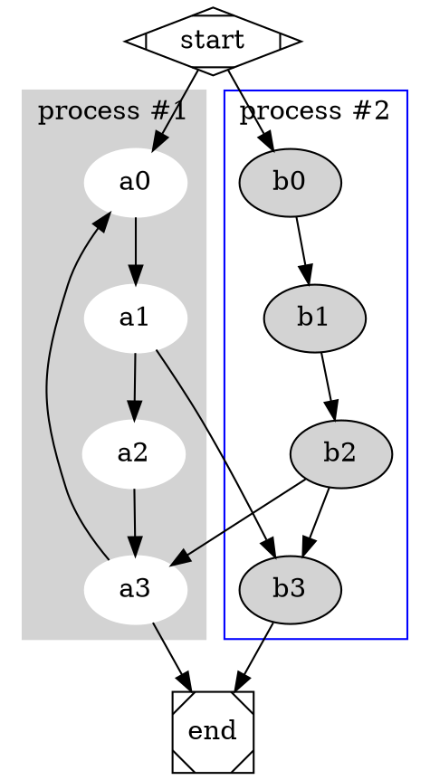

## Latex
$$
 \frac{1}{1 + \frac{1}{1 + \frac{1}{1 + \frac{1}{1 + \frac{1}{\cdots}}}}} 
$$

## Graphviz

```dot
digraph G {

  subgraph cluster_0 {
    style=filled;
    color=lightgrey;
    node [style=filled,color=white];
    a0 -> a1 -> a2 -> a3;
    label = "process #1";
  }

  subgraph cluster_1 {
    node [style=filled];
    b0 -> b1 -> b2 -> b3;
    label = "process #2";
    color=blue
  }
  start -> a0;
  start -> b0;
  a1 -> b3;
  b2 -> a3;
  a3 -> a0;
  a3 -> end;
  b3 -> end;

  start [shape=Mdiamond];
  end [shape=Msquare];
}
```

## Mermaid

```mermaid
graph TD;
    A-->B;
    A-->C;
    B-->D;
    C-->D;
```

